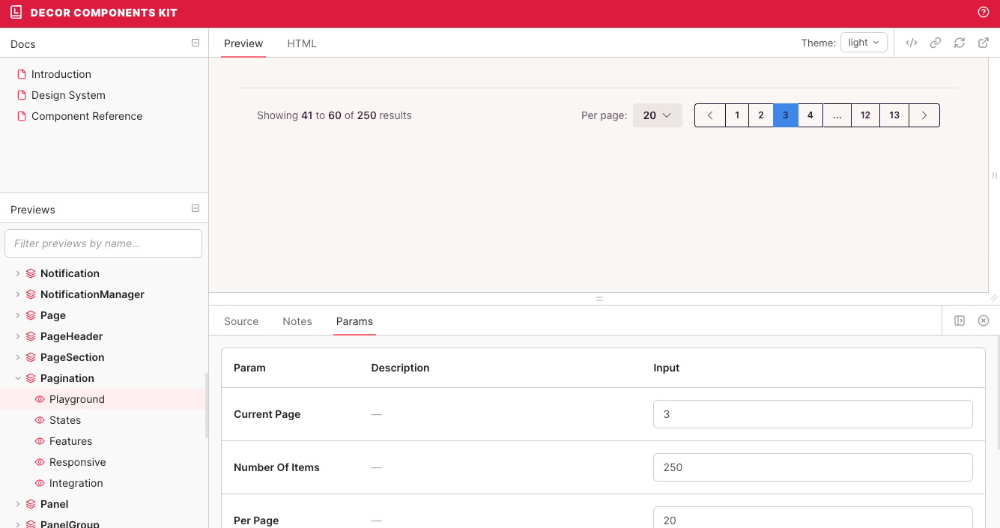

# Decor: UI Components for Ruby on Rails

A comprehensive Ruby on Rails UI component library built for flexibility, maintainability, and developer experience.

## ✨ Features

- **78+ Components**: Includes buttons, forms, modals, navigation, and more, with a focus on flexibility and customization
- **Modern Component Architecture**: Built with [Phlex](https://phlex.fun) and [Vident](https://github.com/stevegeek/vident) for server-side rendering with attribute type safety
- **Beautiful Default Styling**: Powered by [daisyUI](https://daisyui.com) and [Tailwind CSS v4](https://tailwindcss.com), which cah easily be [customized at the component render site](https://github.com/stevegeek/vident/blob/main/README.md?plain=1#L614).
- **Interactive Frontend**: Enhanced with [Stimulus](https://stimulus.hotwired.dev) controllers and [Turbo](https://turbo.hotwired.dev)
- **Developer Experience**: Complete [Lookbook](https://lookbook.build) preview system for component development
- **Tested**: Comprehensive test coverage
- **MIT Licensed**: Free for commercial and personal use



### A note on the state of the project

This project is extracted from a production application and has been in use for years (starting out on a [custom view component system](https://github.com/stevegeek/vc) with my own [typed attributes](https://github.com/stevegeek/typed_support), moving to [ViewComponent](https://viewcomponent.org), and now finally to [Phlex](https://phlex.fun))

**However**, the original was using ViewComponent and styled differently. This open source version is moving to Phlex, daisyUI and Tailwind CSS v4, which means the components are being rewritten 
and in some cases the APIs are changing. Therefore, for the time being, assume that this is a work in progress and not all components
are ready for production. 

Once I port my production application to this version and battle test it, I will update the README to reflect that!

## Main TODOs

- [x] Add all components
- [x] Add more tests / previews
- [x] Update vident, review vident API
- [x] Stop using slots
- [x] Change `dry-struct` to `Literal` (via vident-typed)
- [x] simplify naming of sizes (e.g. `micro` to `xs`, `small` to `sm`, etc.) and unify across components
- [x] Unify variant naming
- [x] Unify style attribute naming (sometimes we use `style`, sometimes `theme`)
- [x] Make previews more consistent
- [ ] Add remaining stimulus controllers from original library
- [ ] Dark mode support

# Using Decor / Installation

You can use Decor in two ways:

## 1. Fork this repository to start a new Rails application

**Fork or clone this repository** to create a new simple Rails application with Decor preconfigured, then build your 
application on top of it.

```
git clone git@github.com:stevegeek/decor.git my_app
cd my_app
# Change the remote to your own repository
git remote set-url origin git@github.com:YOUR_USERNAME/my_app.git

# Install dependencies and run the application
bundle install
yarn install
bin/rails db:prepare
bin/dev
```

If you want to be able to update Decor in the future (recommended), simply pull changes from this repository.

```bash
# Add as an upstream remote
git remote add upstream git@github.com:stevegeek/decor.git
# Pull changes from upstream
git pull upstream main
```

## 2. Copy into an existing Rails application

See instructions in the [wiki](https://github.com/stevegeek/decor/wiki).

# Acknowledgements
 
- Thanks to [daisyUI](https://daisyui.com) for the beautiful default styling and component design
- Thanks to [Phlex](https://phlex.fun) for the view components system
- Thanks to [literal](https://literal.fun) for the typed attributes system
- Thanks to https://github.com/willpinha/daisy-components for the inspiration for certain components
- Thanks to [Lookbook](https://lookbook.build) for the component preview system

Finally thanks to [Confinus](https://confinus.com) for sponsoring the development of this library and open sourcing it.
